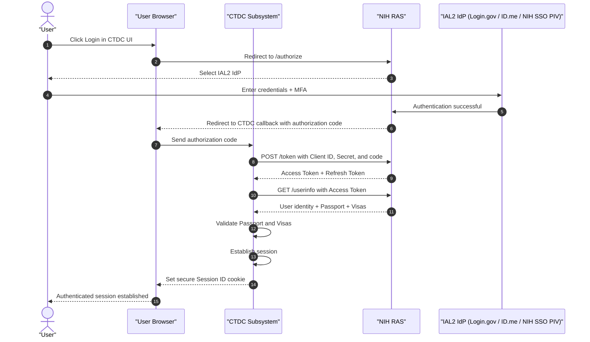
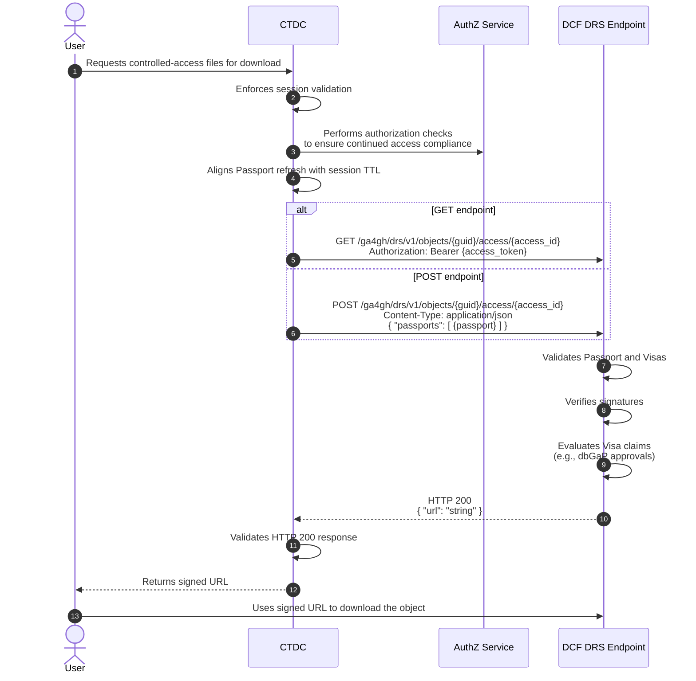
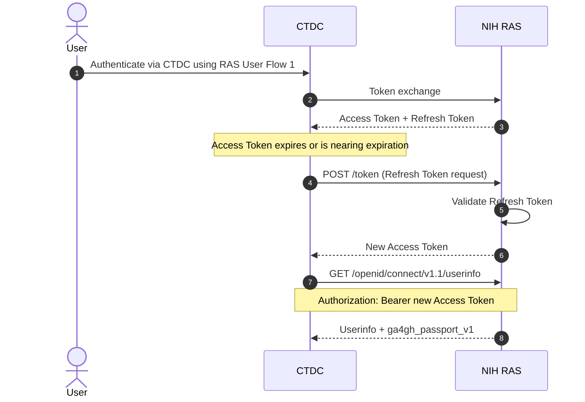

NIH RAS Integration Guide


# RAS Overview

RAS (Researcher Auth Service) is a cloud-based authentication and authorization platform used to securely access NIH data. It provides single sign-on (SSO) across multiple systems, verifies user identities, manages permissions, and logs access activity. This improves security, usability, and efficiency for researchers working with sensitive biomedical data.

# Why RAS is Required

RAS is required to access NIH Controlled Access Data Repositories (CADRs). While eRA Commons accounts typically operate at **IAL1 (low assurance)**, CADRs require at least **IAL2 (moderate assurance)**, which ensures verified real-world identity.

RAS enables this higher level of assurance by enforcing security standards and providing consistent authentication, authorization, and auditing across NIH systems.

## How to Meet IAL2 Requirements

To comply with IAL2 for CADR access:

- **Create or use an IAL2-verified identity**
  - Use providers such as **Login.gov** or **ID.me**
  - Requires identity verification (e.g., government ID, phone, SSN)
- **Sign in to RAS using the IAL2 account**
  - RAS recognizes and trusts the verified identity
- **Link the IAL2 identity to your eRA Commons account**
  - Connects your verified identity with your NIH account
- **Access CADRs through RAS (SSO)**
  - Meets the minimum IAL2 compliance requirement

This approach enhances your existing access without replacing eRA Commons-RAS acts as a secure bridge that strengthens identity assurance.

## Reference: Identity Assurance Levels

**IAL1 (Low Assurance)**

- No requirement to verify real-world identity
- User attributes are self-asserted
- Suitable for low-risk applications
- **Not acceptable for CADR access**

**IAL2 / IAP High (Moderate Assurance)**

- Requires verification of real-world identity
- Supports remote or in-person identity proofing
- Appropriate for accessing sensitive (but not classified) data

**IAL3 (High Assurance)**

- Highest level of identity verification
- May require biometrics or multiple forms of identification
- High-risk scenarios (e.g., controlled or sensitive government data)

## Supported IAL2 Identity Providers for CADRs

- Login.gov
- ID.me
- NIH PIV / Smart Card
- InCommon Federation (REFEDS IAP High certified institutions)

## Linking Staging eRA Commons Test Accounts to Login.gov and ID.me

Please follow the steps below to test and link accounts to IdPs:

- **High-level:** Account linking is initiated from the IdP side. Users first authenticate with Login.gov or ID.me, then link their eRA Commons account (not the other way around).
- Documentation:
- Please use [NIH-RAS-CADR UserGuidev2.pdf](https://nih.sharepoint.com/:b:/r/sites/NCI-CBIITFNLRAS/Shared%20Documents/General/RASDocumentation/NIH-RAS-CADR%20UserGuidev2.pdf?csf=1&web=1&e=TRPAvx&xsdata=MDV8MDJ8eWl6aGVuLmNoZW5AbmloLmdvdnxhNmJlMzhlYTAxMjY0ZjJhYmRmZTA4ZGU5MWM0YjA5N3wxNGI3NzU3ODk3NzM0MmQ1ODUwNzI1MWNhMmRjMmIwNnwwfDB8NjM5MTA4NDcxMTEzOTYxMTY1fFVua25vd258VFdGcGJHWnNiM2Q4ZXlKRmJYQjBlVTFoY0draU9uUnlkV1VzSWxZaU9pSXdMakF1TURBd01DSXNJbEFpT2lKWGFXNHpNaUlzSWtGT0lqb2lUV0ZwYkNJc0lsZFVJam95ZlE9PXwwfHx8&sdata=eVpBT2Q3aG45RE4yRlV5Zzlsd0NTWHRDb2RNMlRLZGx4NStMYUFmYVU0dz0%3d) . While written for Production, the same steps apply to Staging and have been validated.
- RAS also provided an additional [helpful document](https://nih.sharepoint.com/:b:/r/sites/NCI-CBIITFNLRAS/Shared%20Documents/General/RASDocumentation/Guidance.for.ID.me.Verification.for.IAL2.pdf?csf=1&web=1&e=VyBNn1&xsdata=MDV8MDJ8eWl6aGVuLmNoZW5AbmloLmdvdnxhNmJlMzhlYTAxMjY0ZjJhYmRmZTA4ZGU5MWM0YjA5N3wxNGI3NzU3ODk3NzM0MmQ1ODUwNzI1MWNhMmRjMmIwNnwwfDB8NjM5MTA4NDcxMTEzOTczMjI0fFVua25vd258VFdGcGJHWnNiM2Q4ZXlKRmJYQjBlVTFoY0draU9uUnlkV1VzSWxZaU9pSXdMakF1TURBd01DSXNJbEFpT2lKWGFXNHpNaUlzSWtGT0lqb2lUV0ZwYkNJc0lsZFVJam95ZlE9PXwwfHx8&sdata=L1ozT0haSEF5b2ljQTJtbzltdWpUNjgzWEtGTndOM0NCNkZmNE5pMTYvUT0%3d) for creating ID.me accounts for IAL2 linking in Staging.
- **Steps**:
- Use RAS UI for linking- [**https://authtest.nih.gov/settings2/profile**](https://authtest.nih.gov/settings2/profile)
- Login using the IdP assigned in the TAPF. Do **not** use real data during this process (fake ID/SSN is acceptable in Staging).
- Click **Link** to attach the provided staging eRA Commons account.
- **Note:** Currently, RAS allows an eRA account to be linked to only one IdP at a time in the UI. To switch IdPs, use: <https://authtest.nih.gov/settings2/testView>
- If testers encounter issues, please compile them [here](https://nih.sharepoint.com/:x:/r/sites/NCI-CBIITFNLRAS/Shared%20Documents/General/TestPlan/LoginIssues.xlsx?d=w093b7d5fb2c843278e5e5026d3e315d6&csf=1&web=1&e=UBLSeX&xsdata=MDV8MDJ8eWl6aGVuLmNoZW5AbmloLmdvdnxhNmJlMzhlYTAxMjY0ZjJhYmRmZTA4ZGU5MWM0YjA5N3wxNGI3NzU3ODk3NzM0MmQ1ODUwNzI1MWNhMmRjMmIwNnwwfDB8NjM5MTA4NDcxMTEzOTg2MzUzfFVua25vd258VFdGcGJHWnNiM2Q4ZXlKRmJYQjBlVTFoY0draU9uUnlkV1VzSWxZaU9pSXdMakF1TURBd01DSXNJbEFpT2lKWGFXNHpNaUlzSWtGT0lqb2lUV0ZwYkNJc0lsZFVJam95ZlE9PXwwfHx8&sdata=L3JSRm1mVGhhMHBlRFVidm5ZdksvNVUvNXBjVDdGZ2N4MU4rdlFLdmtkWT0%3d) so that we can escalate to RAS

All RAS documentation received to date has been consolidated here. Please review and familiarize yourselves.

[RASDocumentation](https://nih.sharepoint.com/:f:/r/sites/NCI-CBIITFNLRAS/Shared%20Documents/General/RASDocumentation?csf=1&web=1&e=klohze&xsdata=MDV8MDJ8eWl6aGVuLmNoZW5AbmloLmdvdnxhNmJlMzhlYTAxMjY0ZjJhYmRmZTA4ZGU5MWM0YjA5N3wxNGI3NzU3ODk3NzM0MmQ1ODUwNzI1MWNhMmRjMmIwNnwwfDB8NjM5MTA4NDcxMTEzOTk4MzMwfFVua25vd258VFdGcGJHWnNiM2Q4ZXlKRmJYQjBlVTFoY0draU9uUnlkV1VzSWxZaU9pSXdMakF1TURBd01DSXNJbEFpT2lKWGFXNHpNaUlzSWtGT0lqb2lUV0ZwYkNJc0lsZFVJam95ZlE9PXwwfHx8&sdata=YmoyRm9tTUk1NC8wU2VvMEp3K3V1ZGRKdnB3ZHQ5RXhBRHJ0d3NwM096Zz0%3d)

&nbsp;

# workflow

## Authentication



The following steps are taken for users logging into the Clinical and Translational Data Commons (CTDC) subsystem to authenticate with NIH RAS and establish authorized sessions:

- The user clicks the NIH RAS "Login" button in the CTDC user interface.
- The user is redirected to the RAS /authorize endpoint, where they can select an IAL2-compliant IdP (Login.gov, ID.me, NIH SSO with PIV).
- The user provides credentials and completes multi-factor authentication.
- RAS returns an authorization code to the CTDC callback URL.
- CTDC exchanges the authorization code at the RAS /token endpoint .
- RAS issues an Access Token and Refresh Token, ID Token.
- CTDC calls the /userinfo endpoint with the Access Token, Get Passport. 
- RAS returns user identity details along with the Passport and Visas.
- CTDC validates the Passport and establishes a session, storing a secure Session ID cookie in the user's browser.

### Step 1 - User Initiates Login

The user clicks the **"Login using NIH RAS"** button in the User interface.

- This action triggers a redirect to the **RAS /authorize endpoint** to begin the authentication flow.
- The user is presented with a list of **IAL2-compliant Identity Providers (IdPs)** and selects one:
  - **Login.gov**
  - **ID.me**
  - **NIH SSO (PIV / Smart Card)**

This step initiates the secure authentication process required for accessing controlled NIH data.

GET <https://stsstg.nih.gov/auth/oauth/v2/authorize>

?client_id={client_id}

&response_type=code

&redirect_uri=<https://clinical-dev.datacommons.cancer.gov/api/auth/callback>

&scope= openid profile email ga4gh_passport_v1 researcher_role federated_identities_ial2 federated_identities federated_sources source

### **Step 2 - User Authenticates**

The user enters their credentials with the selected Identity Provider and completes **multi-factor authentication (MFA)** to verify their identity at the required IAL2 level.

### **Step 3 - RAS Returns Authorization Code**

After successful authentication, RAS redirects the user's browser back to the **CTDC callback URL**, including an **authorization code**.

### **Step 4 - Exchange Code for Tokens**

Sends a **POST request** to the RAS **/token endpoint**

RAS validates the request and prepares to issue tokens for the session.

**Endpoint:** <https://stsstg.nih.gov/auth/oauth/v2/token>

curl -X POST "<https://stsstg.nih.gov/auth/oauth/v2/token>" \\

\-H "Content-Type: application/x-www-form-urlencoded" \\

\-d "grant_type=authorization_code" \\

\-d "code=YOUR_AUTH_CODE" \\

\-d "redirect_uri=https://clinical-dev.datacommons.cancer.gov/api/auth/callback" \\

\-d "client_id=YOUR_CLIENT_ID" \\

\-d "client_secret=YOUR_CLIENT_SECRET" \\

\-d "scope=openid profile email ga4gh_passport_v1 researcher_role federated_identities_ial2 federated_identities federated_sources source"


### **Step 5 - RAS Returns Tokens**

RAS responds with a set of tokens used for authentication and session management:

- **Access Token** - used to call RAS-protected APIs
- **Refresh Token** - used to obtain new tokens when the session expires
- **ID Token** - contains basic identity information about the user


response:

```json
{
    "access_token": string,
    "token_type": "Bearer",
    "expires_in": 1800,
    "refresh_token": string,
    "scope": "openid profile email ga4gh_passport_v1 researcher_role federated_identities_ial2 federated_identities federated_sources source",
    "id_token": string,
    "id_token_type": "string",
    "resource": [
        "https://stsstg.nih.gov/*"
    ]
}
```


### **Step 6 - Fetch User Info **

CTDC attempts to retrieve user information from the **RAS /userinfo endpoint** using the Access Token.

- If the request fails (e.g., invalid token, expired session, or network issue), an **error condition** occurs
- CTDC must handle the error appropriately, such as:
  - Prompting the user to re-authenticate
  - Logging the failure for troubleshooting
  - Preventing session establishment until resolved

This step ensures that user identity, Passport, and Visas can be securely retrieved before granting access.

curl -X GET "<https://stsstg.nih.gov/openid/connect/v1.1/userinfo>"

\-H "Authorization: Bearer YOUR_ACCESS_TOKEN"

\-H "Accept: application/json"


RAS returns user identity information from the **/userinfo endpoint**, along with the encoded **GA4GH Passport**, which includes the user's **Visas** (authorization claims).

{
  "type": "object",
  "properties": {
    "sub": {
      "type": "string"
    },
    "name": {
      "type": "string"
    },
    "first_name": {
      "type": "string"
    },
    "last_name": {
      "type": "string"
    },
    "preferred_username": {
      "type": "string"
    },
    "userid": {
      "type": "string"
    },
    "email": {
      "type": "string",
      "format": "email"
    },
    "company": {
      "type": "string"
    },
    "source": {
      "type": "string"
    },
    "federated_identities_ial2": {
      "type": "object",
      "properties": {
        "default_identity": {
          "type": "string"
        },
        "authenticated_identity": {
          "type": "string"
        },
        "sources": {
          "type": "object",
          "additionalProperties": {
            "type": "object",
            "properties": {
              "identity_username": {
                "type": "string"
              },
              "ial": {
                "type": "integer"
              },
              "identity_sub": {
                "type": "string"
              }
            },
            "required": [
              "identity_username",
              "ial",
              "identity_sub"
            ]
          }
        },
        "identities": {
          "type": "object",
          "additionalProperties": {
            "type": "object",
            "properties": {
              "mail": {
                "type": "string",
                "format": "email"
              },
              "userid": {
                "type": "string"
              },
              "firstname": {
                "type": "string"
              },
              "lastname": {
                "type": "string"
              }
            },
            "required": [
              "mail",
              "userid",
              "firstname",
              "lastname"
            ]
          }
        }
      },
      "required": [
        "default_identity",
        "authenticated_identity",
        "sources",
        "identities"
      ]
    },
    "txn": {
      "type": "string"
    },
    "passport_jwt_v11": {
      "type": "string"
    }
  },
  "required": [
    "sub",
    "name",
    "first_name",
    "last_name",
    "preferred_username",
    "userid",
    "email",
    "company",
    "source",
    "federated_identities_ial2",
    "txn",
    "passport_jwt_v11"
  ]
}

### **Step 7 - CTDC Validates Passport and Creates Session**

CTDC validates the returned Passport and associated Visas to confirm the user's access permissions.

- Upon successful validation, CTDC establishes an authenticated user session
- A secure cookie is set in the user's browser containing a **Session ID**
- The session is configured with a **30-minute expiration (TTL)** to enforce security and re-authentication requirements

curl -X POST "<https://stsstg.nih.gov/passport/validate>"

\-H "Authorization: Bearer YOUR_PASSPORT_TOKEN"

\-H "Content-Type: application/json"

response:

```string
Valid
Invalid
```

## Access Data Files




The CTDC portal enables authenticated users to browse metadata and distinguish between open-access and controlled-access files. Authorization is enforced using RAS Passports and Visas obtained during login.

Explore Workflow:

The authenticated user navigates to the CTDC Explore page.

The portal displays open-access metadata and indicates which controlled-access files are available based on the user's RAS Passport Visas.

Controlled Data Access Workflow:

When the user requests controlled-access files for download:

CTDC forwards the Passport/Visas to the DCF DRS endpoint using the required mechanism (e.g., Authorization header or DRS-specific method).

There are two endpoints: GET and POST.

The GET endpoint accepts an access token only in the request header. The POST endpoint accepts passports in the request body.

GET Example

access_id is the storage protocol, such as s3, gs, or https.

curl --request GET \
  --url "https://nci-crdc.datacommons.io/ga4gh/drs/v1/objects/{{guid}}/access/{{access_id}}" \
  --header "Authorization: Bearer {{access_token}}"
Returns
{
  "url": "string"
}
POST Example

The request body is JSON with passports as the key. The value of passports is a list of passports. In this example, the list contains only the RAS passport.

curl --request POST \
  --url "https://nci-crdc.datacommons.io/ga4gh/drs/v1/objects/{{guid}}/access/{{access_id}}" \
  --header "Content-Type: application/json" \
  --data '{
    "passports": [
      {{passport}}
    ]
  }'
Returns
{
  "url": "string"
}

DCF validates the Passport and Visas, including signature verification and evaluation of Visa claims (e.g., dbGaP approvals).

If authorized, DCF returns an HTTP 200 response with a pre-signed URL for the requested DRS object.

CTDC validates the HTTP 200 response and inspects the signed URL (e.g., format, expiration).

CTDC attempts to retrieve the object using the signed URL and verifies a successful download or valid redirect.

Throughout this process, CTDC enforces session validation, aligns Passport refresh with session TTL, and performs authorization checks via the AuthZ service to ensure continued access compliance.


## **Access Token Refresh Flow**



- During token exchange, CTDC receives an **Access Token** and a **Refresh Token** from RAS.
- When the Access Token expires or is about to expire:
  - CTDC sends a **refresh token request** to the RAS /token endpoint.
  - RAS validates the Refresh Token and issues a **new Access Token**.

curl -X POST 'https://stsstg.nih.gov/auth/oauth/v2/token' \
  -H 'Content-Type: application/x-www-form-urlencoded' \
  --data-urlencode 'grant_type=refresh_token' \
  --data-urlencode 'refresh_token={token}' \
  --data-urlencode 'client_id={client_id}' \
  --data-urlencode 'client_secret={client_secret}' \
  --data-urlencode 'token_type_hint=refresh_token'


- CTDC then uses the new Access Token to call the **/openid/connect/v1.1/userinfo endpoint**.
- RAS returns the user information, including the **ga4gh_passport_v1 claim**.


## Log out

curl --location 'https://stsstg.nih.gov/connect/session/logout' \
--header 'Content-Type: application/x-www-form-urlencoded' \
--data-urlencode 'client_id={client_id}' \
--data-urlencode 'client_secret={client_secret}' \
--data-urlencode 'id_token={id_token}'


## Decode Passport and Find dbGaP Permissions

After successfully calling the RAS `userinfo` endpoint, the response includes a `passport_jwt_v11` field.

The `passport_jwt_v11` value is a JWT. Decode this JWT to access the GA4GH Passport payload.

### Example `userinfo` Response

```json
{
  "sub": "KJz6Lqlsn0mNWHxsOZMTjpw8IfCcoQY2ibI2VyiZuXU",
  "name": "VERONICA PERSINGER",
  "first_name": "VERONICA",
  "last_name": "PERSINGER",
  "preferred_username": "ngxms-100005464@id.me",
  "userid": "ngxms-100005464",
  "email": "jonkiky@gmail.com",
  "company": "ID.me",
  "source": "ID.me",
  "federated_identities_ial2": {
    "default_identity": "ngxms-100005464@id.me",
    "authenticated_identity": "ngxms-100005464@id.me",
    "sources": {
      "id.me": {
        "identity_username": "ngxms-100005464@id.me",
        "ial": 2,
        "identity_sub": "KJz6Lqlsn0mNWHxsOZMTjpw8IfCcoQY2ibI2VyiZuXU"
      },
      "era": {
        "identity_username": "cheny_pi@era.nih.gov",
        "ial": 2,
        "identity_sub": "n3hgL68Iug1MbNs3SFOHUrawOChHgIYI-Mn3u3Dv3C4"
      }
    },
    "identities": {
      "id.me": {
        "mail": "jonkiky@gmail.com",
        "userid": "ngxms-100005464",
        "firstname": "VERONICA",
        "lastname": "PERSINGER"
      },
      "era": {
        "mail": "yizhen.chen@nih.gov",
        "userid": "cheny_pi",
        "firstname": "VERONICA",
        "lastname": "Yizhen"
      }
    }
  },
  "txn": "26224b06d0cb89d2.b43d6a82b3c4b32f",
  "passport_jwt_v11": "<passport_jwt_v11>"
}
```

### Example Decoded `passport_jwt_v11` Payload

```json
{
  "sub": "KJz6Lqlsn0mNWHxsOZMTjpw8IfCcoQY2ibI2VyiZuXU",
  "jti": "f788dde3-578b-4b3e-a279-74b9ab808415",
  "scope": "openid ga4gh_passport_v1",
  "txn": "26224b06d0cb89d2.b43d6a82b3c4b32f",
  "iss": "https://stsstg.nih.gov",
  "iat": 1779480532,
  "exp": 1779523732,
  "ga4gh_passport_v1": [
    "<token1>",
    "<token2>"
  ]
}
```

The `ga4gh_passport_v1` field contains an array of JWT visa tokens. Each token should be decoded and inspected.

For dbGaP permissions, decode the visa token that contains the `ras_dbgap_permissions` field. In the example above, this is the second token in the `ga4gh_passport_v1` array.

### Example Decoded dbGaP Visa Token

```json
{
  "iss": "https://stsstg.nih.gov",
  "sub": "KJz6Lqlsn0mNWHxsOZMTjpw8IfCcoQY2ibI2VyiZuXU",
  "iat": 1779480532,
  "exp": 1779523732,
  "scope": "openid ga4gh_passport_v1",
  "jti": "48865556-a078-4db5-9446-1a967230ff5a",
  "txn": "26224b06d0cb89d2.b43d6a82b3c4b32f",
  "ga4gh_visa_v1": {
    "type": "https://ras.nih.gov/visas/v1.1",
    "asserted": 1779480532,
    "value": "https://stsstg.nih.gov/passport/dbgap/v1.1",
    "source": "https://ncbi.nlm.nih.gov/gap",
    "by": "dac"
  },
  "ras_dbgap_permissions": [
    {
      "consent_name": "Fake Consent 1",
      "phs_id": "phs000000",
      "version": "v0",
      "participant_set": "p1",
      "consent_group": "c1",
      "role": "designated user",
      "expiration": 1800115980
    }
  ]
}
```

## Permission Lookup Logic

To find the user's dbGaP permissions:

1. Read `passport_jwt_v11` from the `userinfo` response.
2. Decode `passport_jwt_v11`.
3. Read the `ga4gh_passport_v1` array from the decoded passport payload.
4. Decode each JWT in the `ga4gh_passport_v1` array.
5. Find the token that contains the `ras_dbgap_permissions` field.
6. Read the permissions from `ras_dbgap_permissions`.

Each item in `ras_dbgap_permissions` represents one dbGaP permission grant.

### Permission Fields

| Field | Description |
| --- | --- |
| `phs_id` | dbGaP study accession ID |
| `consent_name` | Consent group name |
| `version` | Study version |
| `participant_set` | Participant set |
| `consent_group` | Consent group ID |
| `role` | User's role for this permission |
| `expiration` | Unix timestamp when this permission expires |

## Example Permission Check

A user has access to a study if a decoded visa token contains a matching permission in `ras_dbgap_permissions`.

For example, to check whether the user has access to `phs000000`:

```pseudo
userinfo_response = call_userinfo_endpoint()

passport_jwt = userinfo_response["passport_jwt_v11"]
passport_payload = decode_jwt(passport_jwt)

visa_tokens = passport_payload["ga4gh_passport_v1"]

for token in visa_tokens:
    visa_payload = decode_jwt(token)

    if "ras_dbgap_permissions" in visa_payload:
        permissions = visa_payload["ras_dbgap_permissions"]

        for permission in permissions:
            if permission["phs_id"] == "phs000000":
                return true

return false
```

The application should also check the permission `expiration` value to make sure the grant is still valid.


  
# Reference

## RAS API Specification

<https://stsstg.nih.gov/apidocs/auth/oauth/v2/swagger>

## RAS Sharepoint

<https://nih.sharepoint.com/sites/NCI-CBIITFNLRAS/Shared%20Documents/Forms/AllItems.aspx?id=%2Fsites%2FNCI-CBIITFNLRAS%2FShared%20Documents%2FGeneral&viewid=4e1ee38c-e7d1-402c-b1e8-b67038ce14c5>

## RAS github issue

<https://github.com/NIH-Auth-Services/CIT-IAM-RAS/issues>

## Researcher Auth Service (RAS) Project Service Offerings

<https://auth.nih.gov/docs/RAS/serviceofferings.html>
