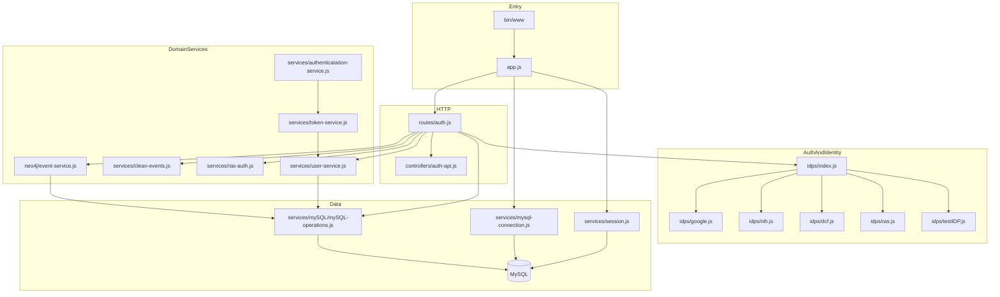

# Component Architecture

## Topology

## Component Inventory

| Area | Component | Evidence | Confidence |
|---|---|---|---|
| HTTP bootstrap | `bin/www` | Creates HTTP server and listens on port | Observed |
| Express app | `app.js` | Middleware, CORS, session middleware, route mounting | Observed |
| Auth router | `routes/auth.js` | Implements `/api/auth` login/logout/authenticated/cleanUp/userInfo | Observed |
| IDP dispatch | `idps/index.js` | Switches login/authenticated/logout by provider | Observed |
| IDP clients | `idps/*.js` | Provider-specific OAuth/userinfo logic | Observed |
| Session storage | `services/session.js` | Uses `express-mysql-session` | Observed |
| TTL endpoint DB query | `services/mysql-connection.js` | Reads `sessions` table expiry | Observed |
| User service | `services/user-service.js` | Session-based user info lookup and token UUID lookup | Observed |
| RAS helper service | `services/ras-auth.js` | Refresh, userinfo, passport validation | Observed |
| Event service | `neo4j/event-service.js` | Current route wiring uses MySQL event writes | Observed |
| Cleanup service | `services/clean-events.js` | Session-cookie driven cleanup path | Observed |

## Boundaries

- **Observed boundary**: Route handlers orchestrate cross-component behavior and hold most workflow logic.
- **Observed boundary**: Data access is concentrated in `services/mySQL/mySQL-operations.js`.
- **Inferred boundary**: `neo4j/event-service.js` functions as a compatibility wrapper with MySQL as active write path in current configuration.
- **Unknown**: Production use of Neo4j path is not confirmed in this bootstrap pass.

## Contradiction Notes

- **Observed contradiction**: Some documentation and naming still imply dual Neo4j/MySQL runtime parity, while current route initialization hard-fails unless MySQL is configured.

## Known Runtime Warnings

- **Observed**: `mysql2` emits warnings for unsupported pool options (`acquireTimeout`, `timeout`) currently passed in MySQL services.
- **Impact**: Warnings are noisy now and may become hard errors in future mysql2 versions.

## What This File Does Not Cover

- **Unknown**: Full behavior matrix for each IDP error response and retry policy.
- **Unknown**: Schema-level documentation for all event tables and migration lifecycle.

See `docs/architecture/runtime-flows.md` for flow categories.
