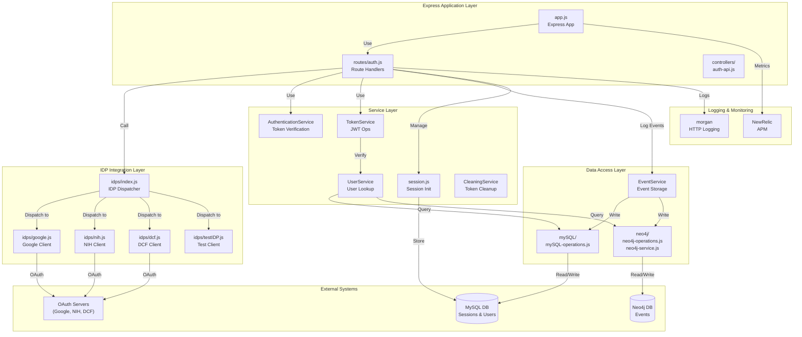

# Component Architecture

## Component Diagram



## Component Descriptions

### Application Layer

| Component | File(s) | Purpose |
|-----------|---------|---------|
| **Express App** | [app.js](../../app.js) | Main Express server initialization; middleware setup; error handler |
| **Route Handler** | [routes/auth.js](../../routes/auth.js) | HTTP route definitions for `/api/auth/*`; request marshaling |
| **Controller** | [controllers/auth-api.js](../../controllers/auth-api.js) | Logout implementation |

### IDP Integration Layer

| Component | File(s) | Purpose |
|-----------|---------|---------|
| **IDP Dispatcher** | [idps/index.js](../../idps/index.js) | Factory pattern; routes login/logout/auth calls to correct IDP client |
| **Google Client** | [idps/google.js](../../idps/google.js) | **Observed**: Handles Google OAuth 2.0 flow |
| **NIH Client** | [idps/nih.js](../../idps/nih.js) | **Observed**: Handles NIH and Login.gov OAuth flows |
| **DCF Client** | [idps/dcf.js](../../idps/dcf.js) | **Inferred**: DCF (Data Commons Framework) OAuth client |
| **Test IDP** | [idps/testIDP.js](../../idps/testIDP.js) | For local/test environments; bypasses real OAuth |

### Service Layer

| Component | File(s) | Purpose |
|-----------|---------|---------|
| **AuthenticationService** | [services/authenticatation-service.js](../../services/authenticatation-service.js) | Verifies tokens in Authorization header; checks session validity |
| **TokenService** | [services/token-service.js](../../services/token-service.js) | JWT signing/verification; token format parsing |
| **UserService** | [services/user-service.js](../../services/user-service.js) | Retrieves user UUIDs from database; delegates to EventService |
| **SessionService** | [services/session.js](../../services/session.js) | Creates express-session middleware with MySQL store |
| **CleaningService** | [services/clean-events.js](../../services/clean-events.js) | **Inferred**: Token validation and expired session cleanup |

### Data Access Layer

| Component | File(s) | Purpose |
|-----------|---------|---------|
| **EventService** | [neo4j/event-service.js](../../neo4j/event-service.js) | Abstraction for storing login/logout/review/download/etc. events to DB |
| **MySQL Operations** | [services/mySQL/mySQL-operations.js](../../services/mySQL/mySQL-operations.js) | SQL query execution for user/session/event data |
| **Neo4j Operations** | [neo4j/neo4j-operations.js](../../neo4j/neo4j-operations.js) | Cypher query execution for event logging and user lookups |
| **Neo4j Service** | [neo4j/neo4j-service.js](../../neo4j/neo4j-service.js) | High-level Neo4j queries (e.g., `getUserTokenUUIDs`) |

### Event Logging Layer

| Component | File(s) | Purpose |
|-----------|---------|---------|
| **Event Models** | [bento-event-logging/model/](../../bento-event-logging/model/) | Event classes (LoginEvent, LogoutEvent, ReviewEvent, DownloadEvent, etc.) |
| **Event Constants** | [bento-event-logging/const/](../../bento-event-logging/const/) | Event type enums, access control constants, format maps |

### External Integrations

| System | Usage | Config |
|--------|-------|--------|
| **Google OAuth** | User authentication | `GOOGLE_CLIENT_ID`, `GOOGLE_CLIENT_SECRET`, `GOOGLE_REDIRECT_URL` |
| **NIH OAuth** | User authentication (NIH & Login.gov) | `NIH_CLIENT_ID`, `NIH_CLIENT_SECRET`, `NIH_AUTHORIZE_URL`, etc. |
| **DCF OAuth** | User authentication | `DCF_CLIENT_ID`, `DCF_CLIENT_SECRET`, `DCF_AUTHORIZE_URL`, etc. |
| **MySQL** | Session store & user data | `MYSQL_HOST`, `MYSQL_USER`, `MYSQL_DATABASE`, etc. |
| **Neo4j** | Event audit log | `NEO4J_URI`, `NEO4J_USER`, `NEO4J_PASSWORD` |
| **NewRelic** | APM/monitoring | [newrelic.js](../../newrelic.js) config |

## Dependency Relationships

```
Login Request
    ├─> route handler (/api/auth/login)
    ├─> IDP dispatcher (idps/index.js)
    │   └─> IDP client (Google/NIH/DCF)
    │       └─> external OAuth server
    ├─> TokenService (create JWT)
    ├─> UserService (verify user record)
    ├─> EventService (log login event)
    └─> response with token & timeout

Authentication Check
    ├─> AuthenticationService.authenticate()
    ├─> TokenService.authenticateUserToken()
    ├─> UserService.getUserTokenUUIDs()
    └─> [response: token valid or not]
```

## Configuration Scope

All components use centralized config ([config.js](../../config.js)) for:
- IDP credentials (Google, NIH, DCF, test)
- Database connection strings (MySQL, Neo4j)
- Session timeout and secrets
- Logging paths
- Environment mode (development/production)

---

Next: [Runtime Flows](./runtime-flows.md) — See how these components interact during authentication requests.
