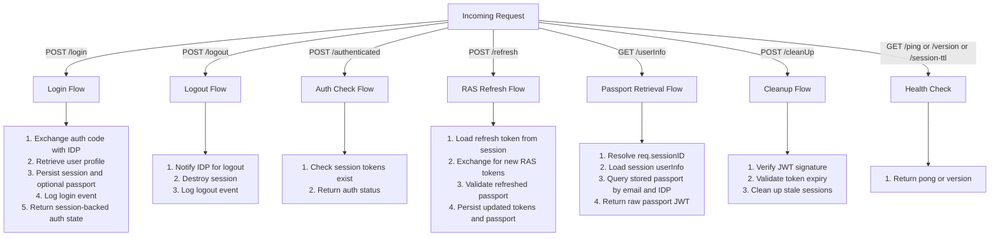
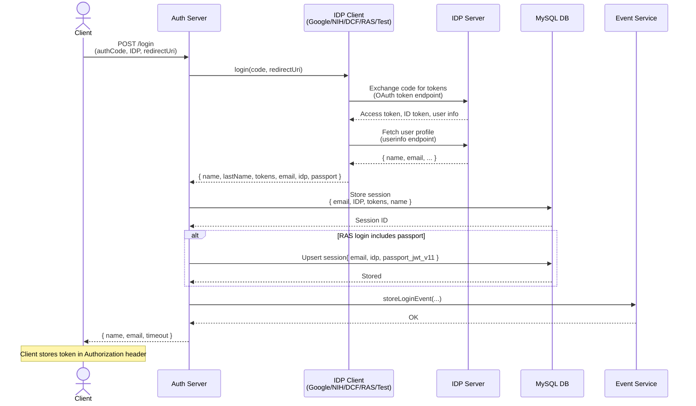
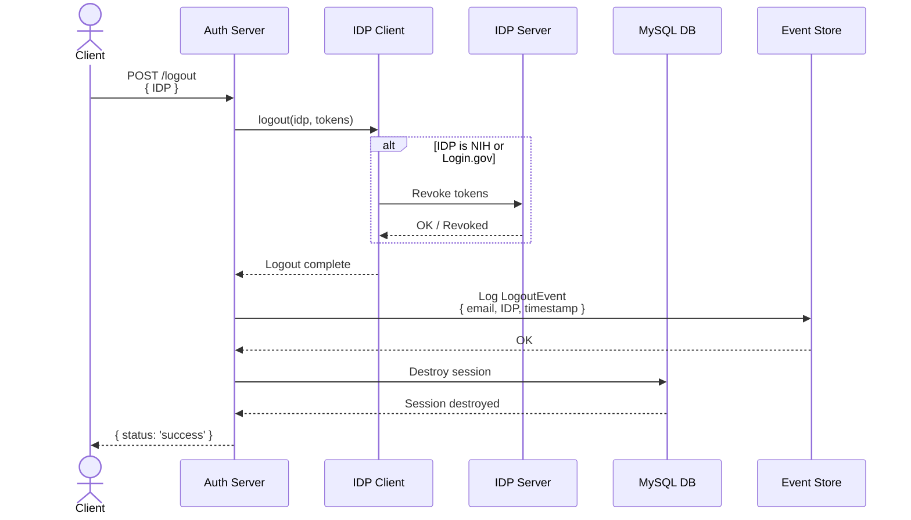
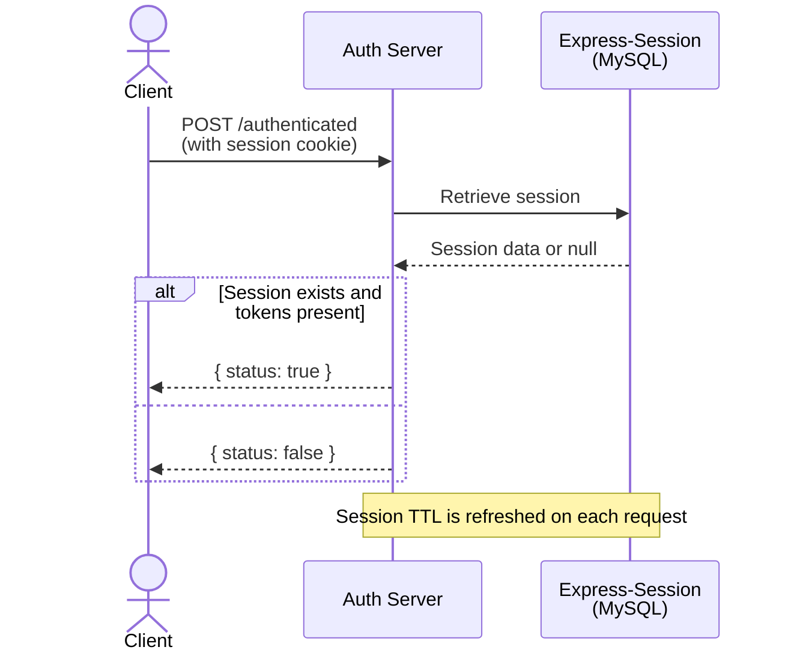
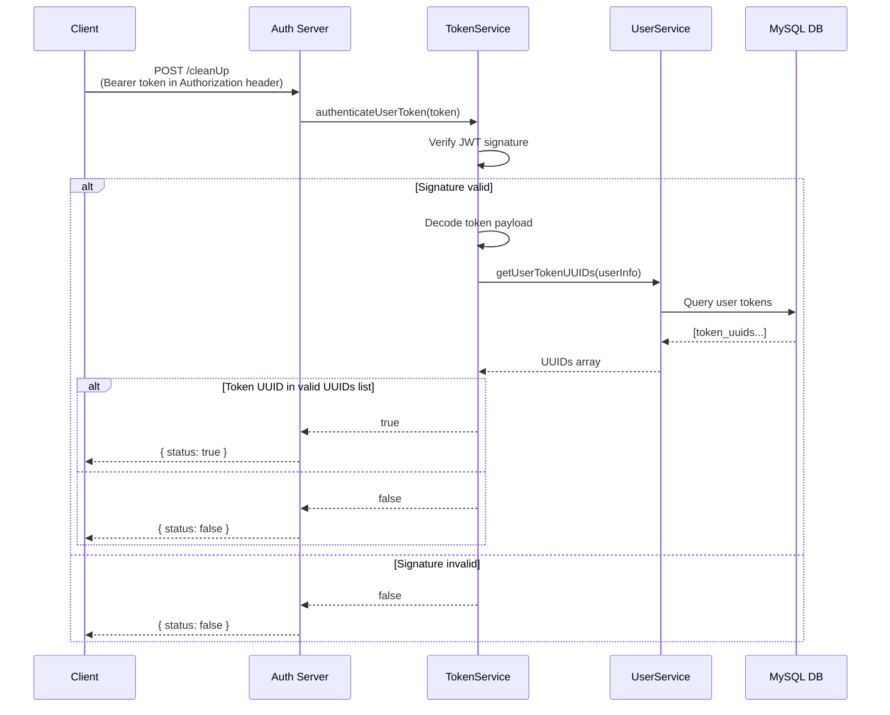
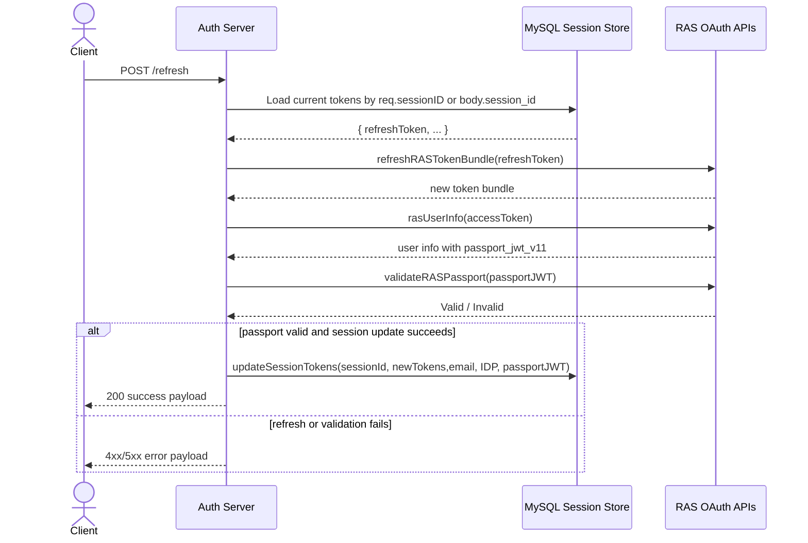
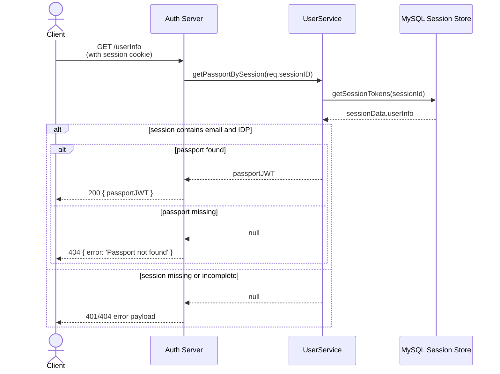
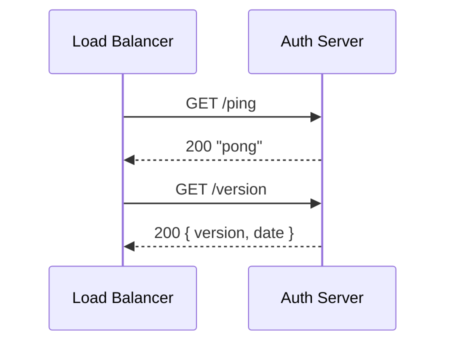

# Runtime Flows & Request Processing

## Top-Level Flow Categories

## 1. Login Flow

**Endpoint**: `POST /api/auth/login`  
**Input**: `{ code: string, IDP: string, redirectUri: string }`  
**Output**: `{ name, email, timeout }`

**Code Path**:  
1. [routes/auth.js — POST /login handler](../../routes/auth.js#L52-L83)  
2. [idps/index.js — oauth2Client.login()](../../idps/index.js#L7-L19)  
3. IDP clients in [idps/](../../idps/) including [idps/ras.js](../../idps/ras.js)  
4. [services/session.js — express-session middleware](../../services/session.js)  
5. [services/mySQL/mySQL-operations.js — storeLoginEvent()](../../services/mySQL/mySQL-operations.js)

---

## 2. Logout Flow

**Endpoint**: `POST /api/auth/logout`  
**Input**: `{ IDP: string }`  
**Output**: `{ status: 'success' }`

**Code Path**:  
1. [routes/auth.js — POST /logout handler](../../routes/auth.js#L86-L107)  
2. [idps/index.js — oauth2Client.logout()](../../idps/index.js#L32-L37)  
3. [idps/nih.js — logout() implementation](../../idps/nih.js)  
4. [controllers/auth-api.js — logout() session destroy](../../controllers/auth-api.js#L1-L10)

---

## 3. Authentication Check Flow

**Endpoint**: `POST /api/auth/authenticated`  
**Input**: (session required)  
**Output**: `{ status: true | false }`

**Code Path**:  
1. [routes/auth.js — POST /authenticated handler](../../routes/auth.js#L110-L120)  
2. Session middleware: [services/session.js](../../services/session.js)

---

## 4. Cleanup Flow

**Endpoint**: `POST /api/auth/cleanUp`  
**Input**: (Authorization header with JWT token optional)  
**Output**: `{ status: true | false }`

**Code Path**:  
1. [routes/auth.js — POST /cleanUp handler](../../routes/auth.js#L122-L130)  
2. [services/clean-events.js — checkTokenAndClean()](../../services/clean-events.js)  
3. [services/token-service.js — TokenService.authenticateUserToken()](../../services/token-service.js#L8-L14)

---

## 5. RAS Refresh Flow

**Endpoint**: `POST /api/auth/refresh`  
**Input**: session ID from request body or current session; existing refresh token in session-backed data  
**Output**: `{ status: 'success', email, expires_at }`

**Code Path**:  
1. [routes/auth.js — POST /refresh handler](../../routes/auth.js#L135-L211)  
2. [services/ras-auth.js — refreshRASTokenBundle()](../../services/ras-auth.js#L34-L53)  
3. [services/ras-auth.js — rasUserInfo()](../../services/ras-auth.js#L55-L67)  
4. [services/ras-auth.js — validateRASPassport()](../../services/ras-auth.js#L69-L79)  
5. [services/mySQL/mySQL-operations.js — updateSessionTokens()](../../services/mySQL/mySQL-operations.js#L341-L384)

---

## 6. Passport Retrieval Flow

**Endpoint**: `GET /api/auth/userInfo`  
**Input**: authenticated session cookie  
**Output**: `{ passportJWT }` or an error response

**Code Path**:  
1. [routes/auth.js — GET /userInfo handler](../../routes/auth.js#L236-L261)  
2. [services/user-service.js — getPassportBySession()](../../services/user-service.js#L29-L58)  
3. [services/mySQL/mySQL-operations.js — getSessionTokens()](../../services/mySQL/mySQL-operations.js)  
4. [services/mySQL/mySQL-operations.js — getPassportByEmail()](../../services/mySQL/mySQL-operations.js#L387-L414)

---

## 7. Health Check Flow

**Endpoint**: `GET /api/auth/ping` and `GET /api/auth/version`  
**Purpose**: Lightweight readiness/health checks for load balancers and orchestrators

**Code Path**:  
1. [app.js — GET /ping handler](../../app.js#L40-L43)  
2. [app.js — GET /version handler](../../app.js#L45-L50)

---

## Cross-Cutting Concerns

### Session Management

- **Technology**: `express-session` + `express-mysql-session` store  
- **Behavior**: HTTP-only session cookies; server-side store in MySQL  
- **TTL**: Configurable via `SESSION_TIMEOUT` env var (default 30 min)  
- **Refresh**: Session expiry is reset on every request  
- **Code**: [services/session.js](../../services/session.js)

### Token Validation Strategy

**Two methods** depending on context:

| Method | Use Case | Code |
|--------|----------|------|
| **Session Token** | Intra-service requests | Check `req.session.tokens` |
| **JWT Bearer Token** | Cross-service/API calls | Parse `Authorization: Bearer <jwt>` header; verify signature |

- Session checks are fast (in-memory after MySQL read)  
- JWT checks require cryptographic verification  
- **Code**: [services/token-service.js](../../services/token-service.js)

### Event Logging

All authentication events are recorded to database:

| Event Type | When | Fields |
|----------|------|--------|
| `LOGIN` | Successful login | email, IDP, firstName, timestamp |
| `LOGOUT` | Successful logout | email, IDP, firstName, timestamp |
| `REVIEW` | User reviews data | (format depends on domain) |
| `DOWNLOAD` | User downloads file | (format depends on domain) |

- **Code**: [bento-event-logging/model/](../../bento-event-logging/model/)  
- **Observed runtime path**: Event writes are handled through [services/mySQL/mySQL-operations.js](../../services/mySQL/mySQL-operations.js) in the current startup path

### RAS Passport Lifecycle

- **Observed**: RAS login may return `passportJWT`, which is written to `ctdc.user_passports`
- **Observed**: `POST /api/auth/refresh` refreshes tokens, fetches updated user info, validates the refreshed passport, and persists it back to MySQL when the session IDP is RAS
- **Observed**: `GET /api/auth/userInfo` returns the raw stored passport JWT for the authenticated session without decoding claims

---

## Known Gaps & Uncertainties

| Unknown | Impact | Status |
|---------|--------|--------|
| DCF client implementation | May have special error handling | Not inspected |
| Event format for REVIEW/DOWNLOAD events | Audit logging accuracy | Deferred to feature docs |
| Non-RAS token refresh strategy | Session extension mechanics for other IDPs | Not yet confirmed |
| MySQL event volume perf characteristics | Deployment decisions | Needs load test |

---

Next: [Modules README](../modules/README.md) for per-module detail.
