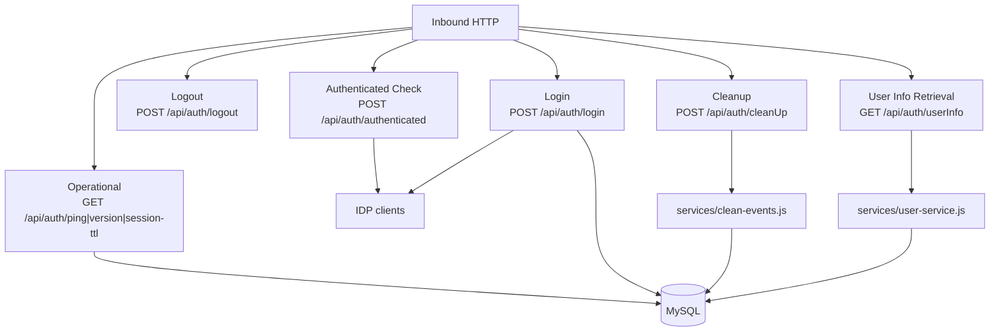

# Runtime Flows (Bootstrap Index)

This file is a top-level flow category index for first-run architecture docs. It is not a full step-by-step trace for every feature.

## Top-Level Categories

## Flow Category Index

| Category | Entrypoints | Main Runtime Components | Confidence |
|---|---|---|---|
| Login and session creation | `POST /api/auth/login` | `routes/auth.js`, `idps/index.js`, provider clients, `EventService` | Observed |
| Logout and session teardown | `POST /api/auth/logout` | `routes/auth.js`, `controllers/auth-api.js`, IDP logout path | Observed |
| Session-backed auth check | `POST /api/auth/authenticated` | `routes/auth.js`, IDP authenticated call | Observed |
| User info retrieval | `GET /api/auth/userInfo` | `routes/auth.js`, `services/user-service.js`, `services/mySQL/mySQL-operations.js#getSessionData` | Observed |
| Cleanup and maintenance | `POST /api/auth/cleanUp` | `services/clean-events.js`, MySQL operations | Observed |
| Operational health/metadata | `GET /api/auth/ping`, `GET /api/auth/version`, `GET /api/auth/session-ttl` | `app.js`, `services/mysql-connection.js` | Observed |

## Not Yet Deep-Traced

- **Unknown**: Full per-IDP failure path differences for Google/NIH/DCF/Test under `/authenticated` and `/logout`.
- **Unknown**: Whether all cleanup logic paths are exercised in production.
- **Observed**: There is currently no `/api/auth/refresh` route in `routes/auth.js`.

## Suggested Next Deep Docs (On Demand)

- `docs/features/login.md`
- `docs/features/logout.md`
- `docs/features/user-info.md`

- Session checks are fast (in-memory after MySQL read)  
- JWT checks require cryptographic verification  
- **Code**: [services/token-service.js](../../services/token-service.js)

### Event Logging

All authentication events are recorded to database:

| Event Type | When | Fields |
|----------|------|--------|
| `LOGIN` | Successful login | email, IDP, firstName, timestamp |
| `LOGOUT` | Successful logout | email, IDP, firstName, timestamp |
| `REVIEW` | User reviews data | (format depends on domain) |
| `DOWNLOAD` | User downloads file | (format depends on domain) |

- **Code**: [bento-event-logging/model/](../../bento-event-logging/model/)  
- **Observed runtime path**: Event writes are handled through [services/mySQL/mySQL-operations.js](../../services/mySQL/mySQL-operations.js) in the current startup path

### RAS Passport Lifecycle

- **Observed**: RAS login validates `passport_jwt_v11` through `validateRASPassport` in `idps/ras.js`.
- **Observed**: Current runtime route set does not include `POST /api/auth/refresh`.
- **Observed**: `GET /api/auth/userInfo` returns `sessionData.userInfo` from the session record via `UserService#getUserInfo`, not a passport table lookup.

---

## Known Gaps & Uncertainties

| Unknown | Impact | Status |
|---------|--------|--------|
| DCF client implementation | May have special error handling | Not inspected |
| Event format for REVIEW/DOWNLOAD events | Audit logging accuracy | Deferred to feature docs |
| Non-RAS token refresh strategy | Session extension mechanics for other IDPs | Not yet confirmed |
| MySQL event volume perf characteristics | Deployment decisions | Needs load test |

---

Next: [Modules README](../modules/README.md) for per-module detail.
