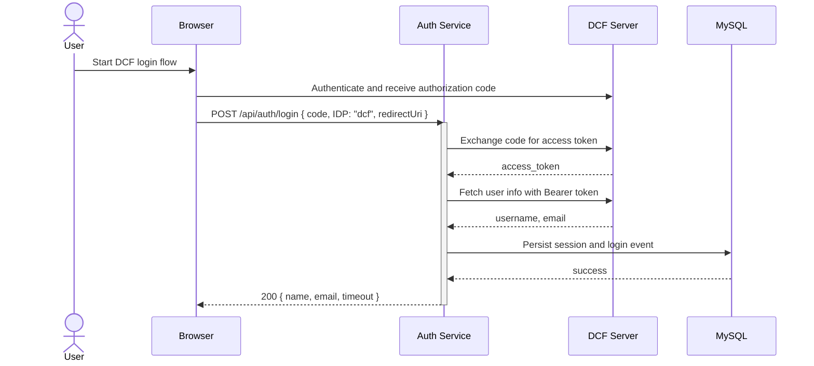
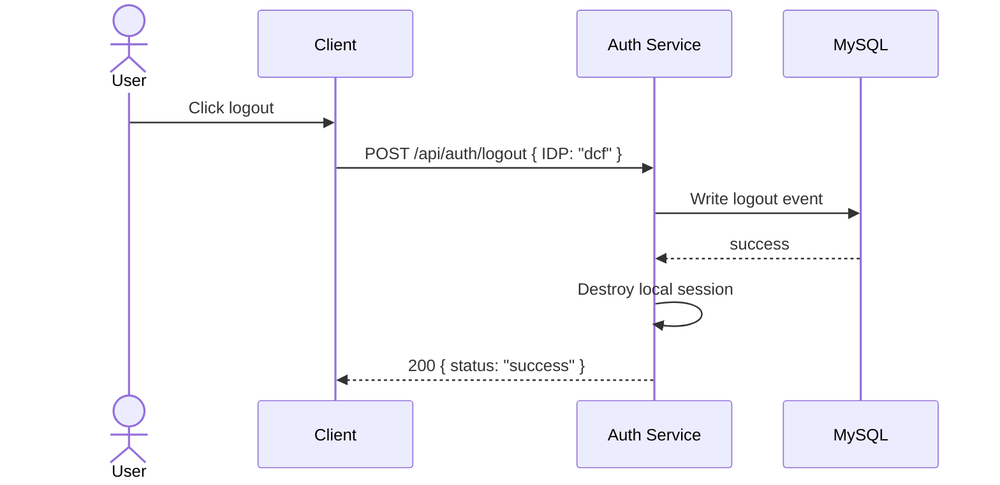

# DCF/Fence Login Feature

## Overview

This document describes the current implementation state for DCF-related login in the auth service.

**Observed**: The active route path supports `IDP=dcf` during `POST /api/auth/login` and exchanges the authorization code against the DCF endpoints configured in [config.js](../../config.js).

**Observed**: The repository also contains a [idps/fence.js](../../idps/fence.js) module, but it is not wired into the IDP dispatcher in [idps/index.js](../../idps/index.js).

**Observed**: The file name still says "DCF/Fence", but the current runtime behavior is better described as **partial DCF login support** rather than full DCF/Fence support.

## Current Status

| Area | Status | Notes |
|---|---|---|
| DCF login dispatch | Implemented | `IDP=dcf` is routed through [idps/index.js](../../idps/index.js) to [idps/dcf.js](../../idps/dcf.js) |
| DCF token exchange | Implemented | Uses `DCF_TOKEN_URL` in [services/dcf-auth.js](../../services/dcf-auth.js) |
| DCF user info fetch | Implemented | Uses `DCF_USERINFO_URL` in [services/dcf-auth.js](../../services/dcf-auth.js) |
| Session creation | Implemented | Session fields are populated in [routes/auth.js](../../routes/auth.js) |
| Event logging | Implemented | Current runtime writes events through MySQL-backed operations |
| DCF-specific authenticated check | Not wired | `POST /api/auth/authenticated` only checks whether session tokens exist |
| DCF-specific logout dispatch | Not wired | [idps/index.js](../../idps/index.js) does not route DCF logout |
| Fence-specific login path | Not wired | [idps/fence.js](../../idps/fence.js) exists but is unused by the dispatcher |

## Login Flow

**Endpoint**: `POST /api/auth/login`

**Observed request body**:

```json
{
  "code": "authorization-code-from-dcf",
  "IDP": "dcf",
  "redirectUri": "https://app.example.com/callback"
}
```

### Sequence Diagram



### Code Path

1. [routes/auth.js](../../routes/auth.js)
   `POST /api/auth/login` reads `req.body.IDP`, resolves the redirect URL, stores `req.session.userInfo`, and writes a login event.

2. [idps/index.js](../../idps/index.js)
   The dispatcher routes `dcf` to `dcfClient.login(code, redirectingURL)`.

3. [idps/dcf.js](../../idps/dcf.js)
   The DCF client exchanges the code for a token, fetches DCF user info, and maps the response into `{ name, lastName, email, tokens, idp: 'dcf' }`.

4. [services/dcf-auth.js](../../services/dcf-auth.js)
   `getDCFToken()` performs the token exchange and `dcfUserInfo()` fetches the user profile.

5. [routes/auth.js](../../routes/auth.js)
   After session population, `eventService.storeLoginEvent(...)` is called. In the current startup path, that event write ends up in MySQL-backed operations.

## Session Data

**Observed session fields after successful login**:

```javascript
req.session.userInfo = {
  email,
  IDP: idp,
  firstName: name,
  lastName: lastName,
  tokens: tokens
};

req.session.tokens = tokens;
```

**Observed behavior**:
- `name` and `lastName` are both sourced from `user.username` in [idps/dcf.js](../../idps/dcf.js)
- `tokens` is the access token returned by `getDCFToken()`
- `IDP` is normalized later through `formatVariables(...)` in [routes/auth.js](../../routes/auth.js)

## Event Logging

**Observed**: The login and logout routes call `eventService.storeLoginEvent(...)` and `eventService.storeLogoutEvent(...)` from [neo4j/event-service.js](../../neo4j/event-service.js).

**Observed**: Despite the file location, the active runtime in [routes/auth.js](../../routes/auth.js) only initializes when `DATABASE_TYPE` is `MYSQL`.

**Observed**: In the MySQL branch, the event service delegates to [services/mySQL/mySQL-operations.js](../../services/mySQL/mySQL-operations.js).

**Conclusion**: The current DCF login flow records events through MySQL, not Neo4j.

## Authenticated Check

**Endpoint**: `POST /api/auth/authenticated`

The current feature document previously described a provider-backed DCF validation call here. That is not what the implementation does now.

**Observed implementation** in [routes/auth.js](../../routes/auth.js):

```javascript
const isAuthenticated = Boolean(req?.session?.tokens);
res.status(200).send({ status : isAuthenticated });
```

**Observed implications**:
- The endpoint does not call [idps/dcf.js](../../idps/dcf.js) `authenticated()`
- The endpoint does not call the DCF userinfo endpoint
- The endpoint is currently a local session-token presence check only

## Logout Flow

**Endpoint**: `POST /api/auth/logout`

The current feature document previously described a DCF logout call followed by event logging and session destruction. The actual implementation is narrower.

### Observed Runtime Behavior

1. [routes/auth.js](../../routes/auth.js) calls `idpClient.logout(idp, req.session.tokens)`.
2. [idps/index.js](../../idps/index.js) only dispatches logout for `nih` and `login.gov`.
3. For `dcf`, the dispatcher returns `undefined`, so [services/dcf-auth.js](../../services/dcf-auth.js) `dcfLogout()` is not reached through the active route.
4. The route still writes a logout event and destroys the local session if `req.session.userInfo` exists.

### Sequence Diagram



### Important Gap

**Observed**: A DCF logout helper exists in [services/dcf-auth.js](../../services/dcf-auth.js), but it is not used by the current logout dispatcher for `dcf`.

## Fence Module Status

The repository contains [idps/fence.js](../../idps/fence.js), but the current implementation does not expose it through [idps/index.js](../../idps/index.js).

**Observed details**:
- The dispatcher imports only `google`, `nih`, `dcf`, and `testIDP`
- No `fence` case exists in the login dispatcher
- [idps/fence.js](../../idps/fence.js) currently uses Google OAuth client setup and returns `idp: GOOGLE`

**Conclusion**: Fence-specific behavior is not currently active in the runtime path.

## Configuration

DCF settings are loaded from [config.js](../../config.js):

```javascript
DCF: {
  CLIENT_ID: process.env.DCF_CLIENT_ID,
  CLIENT_SECRET: process.env.DCF_CLIENT_SECRET,
  BASE_URL: process.env.DCF_BASE_URL,
  REDIRECT_URL: process.env.DCF_REDIRECT_URL,
  USERINFO_URL: process.env.DCF_USERINFO_URL,
  AUTHORIZE_URL: process.env.DCF_AUTHORIZE_URL,
  TOKEN_URL: process.env.DCF_TOKEN_URL,
  LOGOUT_URL: process.env.DCF_LOGOUT_URL,
  SCOPE: process.env.DCF_SCOPE,
  PROMPT: process.env.DCF_PROMPT
}
```

## Known Gaps

| Gap | Current effect |
|---|---|
| DCF `authenticated()` helper is not used by the route | Provider-backed token validation is not performed on `/api/auth/authenticated` |
| DCF logout helper is not dispatched from [idps/index.js](../../idps/index.js) | Local logout works, but provider logout is not part of the active path |
| Fence module is not wired into the dispatcher | The feature is not actually a combined DCF/Fence runtime flow |
| Event service lives under a Neo4j path name | Repository structure suggests dual storage, but active runtime uses MySQL |
| No explicit HTTP timeout handling in [services/dcf-auth.js](../../services/dcf-auth.js) | DCF network calls may wait longer than desired |

## Confidence Notes

- **Observed**: `dcf` login dispatch exists and reaches token exchange plus userinfo fetch
- **Observed**: Session creation and event writes occur in the login route
- **Observed**: Current startup path only initializes the auth route services for `DATABASE_TYPE=MYSQL`
- **Observed**: DCF logout and provider-backed authenticated validation are not wired through the current route dispatcher
- **Observed**: Fence module exists in the repository but is not part of the active dispatcher
- **Unknown**: Whether the unused Fence module is a planned future path or obsolete code

## Suggested Follow-Up

1. Wire `dcf` into `idpClient.logout(...)` if remote DCF logout is required.
2. Decide whether `/api/auth/authenticated` should remain a local session check or call the provider-specific validation path.
3. Either wire a real Fence implementation into [idps/index.js](../../idps/index.js) or rename this document to DCF-only terminology.
