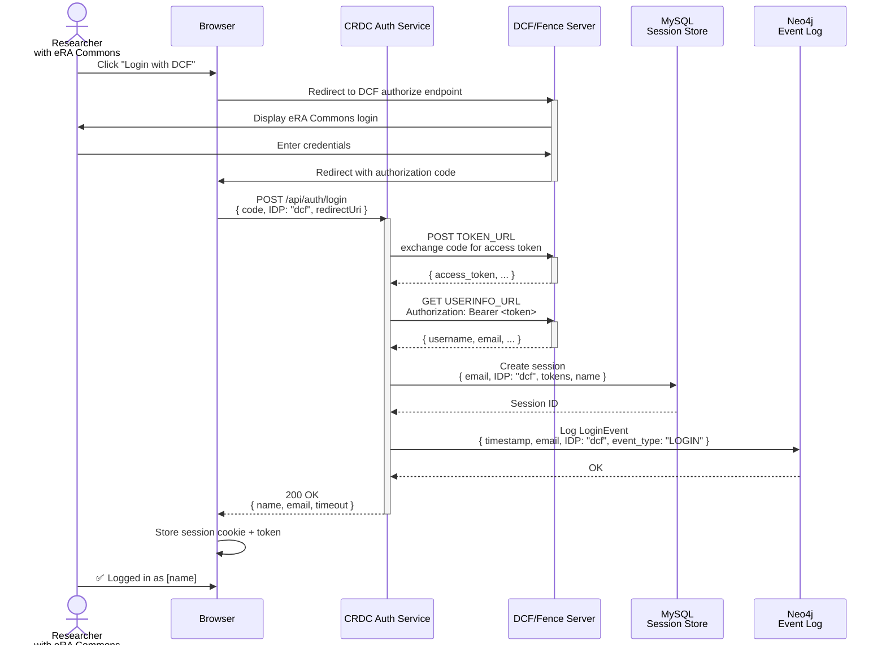
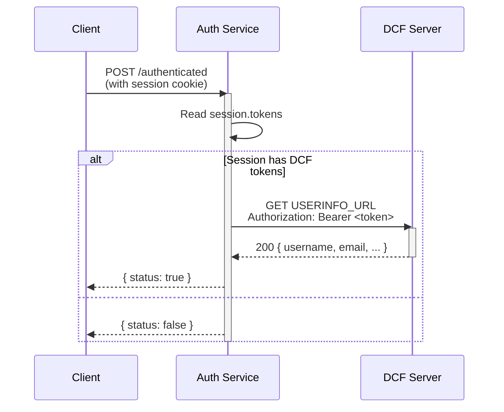
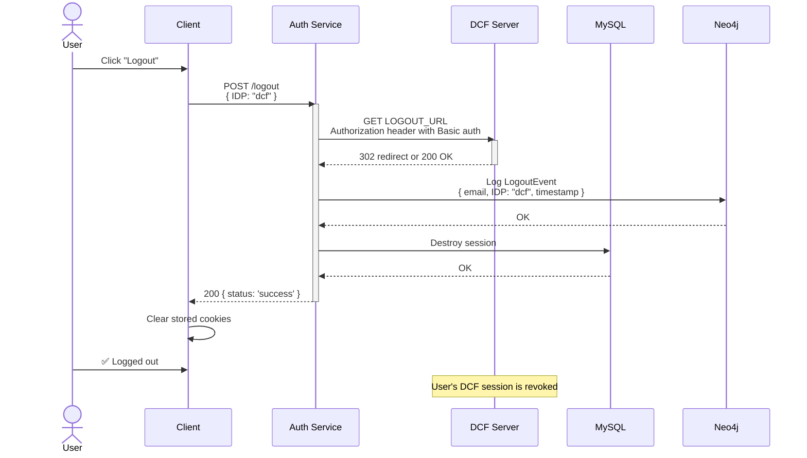

# DCF/Fence Login Feature

## Overview

This feature enables user authentication against **Data Commons Framework (DCF) / Fence** identity provider, an eRA Commons-integrated OAuth 2.0 service used by the National Institutes of Health and related biomedical research systems.

**Scope**: Covers login, authentication validation, and logout for DCF/Fence-authenticated users.

**Status**: **Observed** — Full DCF/Fence implementation present and functional; tested integration with Fence OAuth endpoints.

---

## User Story

As a researcher with an **eRA Commons account** (NIH credential), I want to log into CTDC/CRDC using my existing NIH identity without creating a separate account.

---

## Prerequisites

1. **DCF/Fence Server** accessible at configured URLs
2. **User has eRA Commons ID** issued by NIH
3. **OAuth credentials** registered with DCF/Fence:
   - `DCF_CLIENT_ID`
   - `DCF_CLIENT_SECRET`
   - `DCF_REDIRECT_URL` (must match registered redirect URL at Fence)
4. **DCF public key** installed locally (if signature verification needed; not yet observed in code)

---

## Happy Path Flow: Login

**Endpoint**: `POST /api/auth/login`  
**Request Body**:
```json
{
  "code": "eRA123abc456def...",  // OAuth authorization code from DCF
  "IDP": "dcf",                   // or "DCF" (case-insensitive)
  "redirectUri": "https://app.example.com/callback"  // Must match DCF redirect
}
```

### Sequence Diagram



### Code Path: Login Implementation

1. **Route Handler** → [routes/auth.js line 52-83](../../routes/auth.js#L52-L83)
   ```javascript
   router.post('/login', async function (req, res) {
       const reqIDP = config.getIdpOrDefault(req.body['IDP']);  // "dcf"
       const { name, lastName, tokens, email, idp } = await idpClient.login(
           req.body['code'], 
           reqIDP, 
           config.getUrlOrDefault(reqIDP, req.body['redirectUri'])
       );
       // ... store session, log event
   });
   ```

2. **IDP Dispatcher** → [idps/index.js line 7-19](../../idps/index.js#L7-L19)
   ```javascript
   oauth2Client.login: async (code, idp, redirectingURL) => {
       case isCaseInsensitiveEqual(idp, DCF):
           return dcfClient.login(code, redirectingURL);
   }
   ```

3. **DCF Client Login** → [idps/dcf.js](../../idps/dcf.js)
   ```javascript
   login: async (code, redirectingURL) => {
       const token = await getDCFToken(code, redirectingURL);
       const user = await dcfUserInfo(token);
       return {
           name: user.username,
           lastName: user.username,
           email: user.email,
           tokens: token,
           idp: 'dcf'
       };
   }
   ```

4. **Get DCF Token** → [services/dcf-auth.js — getDCFToken()](../../services/dcf-auth.js#L7-L26)
   ```javascript
   async function getDCFToken(code, redirectURI) {
       const response = await nodeFetch(client.TOKEN_URL, {
           method: 'POST',
           headers: { 'Content-Type': 'application/x-www-form-urlencoded' },
           body: new URLSearchParams({
               code: code,
               redirect_uri: redirectURI,
               grant_type: "authorization_code",
               client_id: client.CLIENT_ID,
               client_secret: client.CLIENT_SECRET,
               scope: "openid%20user%20data"
           })
       });
       return jsonResponse.access_token;
   }
   ```

5. **Get User Info** → [services/dcf-auth.js — dcfUserInfo()](../../services/dcf-auth.js#L41-L50)
   ```javascript
   async function dcfUserInfo(accessToken) {
       const result = await nodeFetch(client.USERINFO_URL, {
           method: 'GET',
           headers: {
               'Authorization': `Bearer ${accessToken}`
           }
       });
       return result.json();  // { username, email, ... }
   }
   ```

---

## Request/Response Details

### Login Request

| Field | Type | Required | Example | Notes |
|-------|------|----------|---------|-------|
| `code` | string | ✅ Yes | `eRA123abc456...` | OAuth authorization code from DCF |
| `IDP` | string | ❌ Optional | `dcf` | Case-insensitive; omit for default IDP |
| `redirectUri` | string | ❌ Optional | `https://app.example.com/callback` | Must match DCF registration |

### Login Success Response (200 OK)

```json
{
  "name": "John",
  "email": "john.doe@nih.gov",
  "timeout": 1800
}
```

| Field | Type | meaning |
|-------|------|---------|
| `name` | string | User's username from DCF (`user.username`) |
| `email` | string | User's email from DCF (`user.email`) |
| `timeout` | number | Session TTL in seconds (from `SESSION_TIMEOUT` env var) |

### Login Error Responses

| Status | Body | Cause |
|--------|------|-------|
| `400` | `{ error: "eRA Commons access token failed..." }` | DCF token endpoint returned non-200 (invalid code or expired) |
| `500` | `{ error: "..." }` | Network error, DCF unreachable, or malformed response |

---

## User Authentication Check

**Endpoint**: `POST /api/auth/authenticated`  
**Purpose**: Verify that user's session is still valid with DCF

### Flow



### Code Path

[idps/dcf.js — authenticated()](../../idps/dcf.js#L13-L27)
```javascript
authenticated: async (tokens) => {
    try {
        if (!tokens) return false;
        await dcfUserInfo(tokens);  // Call DCF userinfo; if it fails, token is invalid
        return true;
    } catch (e) {
        return false;
    }
}
```

**Validation Strategy**:
- **Method**: Call DCF userinfo endpoint with stored access token
- **Implies**: Token is still valid at DCF server
- **Fails if**: Token expired, revoked, or DCF server unreachable

---

## Logout Flow

**Endpoint**: `POST /api/auth/logout`  
**Request Body**:
```json
{
  "IDP": "dcf"
}
```

### Sequence Diagram



### Code Path

1. **Route Handler** → [routes/auth.js line 86-107](../../routes/auth.js#L86-L107)
   ```javascript
   router.post('/logout', async function (req, res) {
       const idp = config.getIdpOrDefault(req.body['IDP']);
       await idpClient.logout(idp, req.session.tokens);
       // ... log event, destroy session
   });
   ```

2. **IDP Dispatcher** → [idps/index.js line 32-37](../../idps/index.js#L32-L37)
   ```javascript
   logout: async (idp, tokens) => {
       if (isCaseInsensitiveEqual(idp, DCF)) {
           return dcfClient.logout(tokens);
       }
   }
   ```

3. **DCF Client Logout** → [idps/dcf.js line 28-31](../../idps/dcf.js#L28-L31)
   ```javascript
   logout: async (tokens) => {
       return await dcfLogout(tokens);
   }
   ```

4. **DCF Logout Call** → [services/dcf-auth.js — dcfLogout()](../../services/dcf-auth.js#L28-L40)
   ```javascript
   async function dcfLogout(tokens) {
       const result = await nodeFetch(client.LOGOUT_URL, {
           method: 'GET',
           headers: {
               'Authorization': 'Basic ' + Buffer.from(
                   client.CLIENT_ID + ':' + client.CLIENT_SECRET
               ).toString('base64')
           },
           body: new URLSearchParams({
               id_token: tokens,
               next: client.REDIRECT_URL,
               force_era_global_logout: true
           })
       });
       return result;
   }
   ```

### DCF Logout Details

| Aspect | Value |
|--------|-------|
| **HTTP Method** | GET |
| **Authentication** | HTTP Basic Auth (client_id:client_secret) |
| **Parameters** | `id_token`, `next`, `force_era_global_logout` |
| **Side Effect** | Revokes user's DCF/eRA Commons session globally (if `force_era_global_logout: true`) |
| **Response** | Usually 302 redirect or 200 OK |

---

## Configuration

All DCF/Fence settings are environment variables, loaded into [config.js](../../config.js#L49-L61):

```javascript
DCF: {
    CLIENT_ID: process.env.DCF_CLIENT_ID,
    CLIENT_SECRET: process.env.DCF_CLIENT_SECRET,
    BASE_URL: process.env.DCF_BASE_URL,
    REDIRECT_URL: process.env.DCF_REDIRECT_URL,
    USERINFO_URL: process.env.DCF_USERINFO_URL,
    AUTHORIZE_URL: process.env.DCF_AUTHORIZE_URL,
    TOKEN_URL: process.env.DCF_TOKEN_URL,
    LOGOUT_URL: process.env.DCF_LOGOUT_URL,
    SCOPE: process.env.DCF_SCOPE,
    PROMPT: process.env.DCF_PROMPT
}
```

### Required Environment Variables

```bash
# OAuth app credentials (register with DCF/Fence admin)
DCF_CLIENT_ID=abc123def456...
DCF_CLIENT_SECRET=xyz789...

# DCF server endpoints
DCF_BASE_URL=https://data.braincommons.org  # or appropriate DCF instance
DCF_AUTHORIZE_URL=https://data.braincommons.org/oauth2/authorize
DCF_TOKEN_URL=https://data.braincommons.org/oauth2/token
DCF_USERINFO_URL=https://data.braincommons.org/oauth2/userinfo
DCF_LOGOUT_URL=https://data.braincommons.org/oauth2/logout

# Local callback (must be registered with DCF)
DCF_REDIRECT_URL=https://auth.myapp.com/callback

# OAuth scopes
DCF_SCOPE=openid user data
```

### Optional Environment Variables

```bash
# Rarely used
DCF_PROMPT=login  # Force re-authentication on each login
```

---

## Data Structures

### User Profile (from DCF)

**Retrieved by**: `dcfUserInfo(accessToken)`  
**Returned by DCF**: JSON object from `/oauth2/userinfo` endpoint

**Typical structure**:
```json
{
  "username": "john.doe",
  "email": "john.doe@nih.gov",
  "sub": "eRA|Commons|123456",
  "aud": "abc123def456...",
  "iss": "https://data.braincommons.org",
  "iat": 1670000000,
  "exp": 1670003600
}
```

| Field | Usage |
|-------|-------|
| `username` | Stored as user's `name` and `lastName` |
| `email` | Stored as user's email in session/tokens |
| `sub` | Subject ID (unique user); not currently captured |
| `exp` | Token expiry (validation check should respect this) |

### Session Object

**Created on login**:
```javascript
req.session.userInfo = {
    email: "john.doe@nih.gov",
    IDP: "dcf",
    firstName: "john.doe",  // from user.username
    lastName: "john.doe",   // from user.username
    tokens: "<access_token>" // from DCF token endpoint
};
req.session.tokens = "<access_token>";  // duplicate for convenience
```

### Stored Login Event (Neo4j/MySQL)

**Created on successful login**:
```javascript
{
    event_type: "LOGIN",
    user_email: "john.doe@nih.gov",
    user_idp: "dcf",
    firstName: "john.doe",
    timestamp: "2024-01-15T14:30:00Z"
}
```

---

## Error Scenarios

### Scenario 1: Invalid Authorization Code

**Cause**: Code is expired, already used, or from wrong DCF instance  
**DCF Response**: Token endpoint returns non-200 status  
**Auth Service Response**: 400 or 500 with error

```
POST /api/auth/login
{ "code": "invalid_code", "IDP": "dcf" }

>>> 400 / 500
{
  "error": "eRA Commons access token failed to create because of invalid access code or unauthorized access"
}
```

**User Action**: User must restart login flow to get fresh authorization code.

---

### Scenario 2: Redirect URI Mismatch

**Cause**: `redirectUri` in request doesn't match `DCF_REDIRECT_URL` registered with DCF  
**DCF Response**: Token endpoint rejects the request  
**Auth Service Response**: 400/500 with validation error

**Prevention**: Ensure `DCF_REDIRECT_URL` env var matches exactly what's registered in DCF console.

---

### Scenario 3: DCF Server Unreachable

**Cause**: Network outage, DNS failure, or DCF downtime  
**Observed Behavior**: Request to DCF token/userinfo endpoint times out or fails  
**Auth Service Response**: 500 error (no explicit timeout handling observed)

**Mitigation**:
- Add HTTP timeout to DCF client calls (currently **not observed** in `dcf-auth.js`)
- Monitor DCF availability from client

---

### Scenario 4: User Session Expires During Active Use

**Cause**: DCF access token has expired (typically 1 hour)  
**Detection**: `POST /authenticated` calls DCF userinfo; returns 401  
**User Experience**: Session check fails; user must log in again

**Code Path**:
```javascript
// In idps/dcf.js
authenticated: async (tokens) => {
    try {
        await dcfUserInfo(tokens);  // <- 401 if expired
        return true;
    } catch (e) {
        return false;  // <- User sees: not authenticated
    }
}
```

**Note**: No refresh token support observed; users must re-authenticate.

---

### Scenario 5: Logout Fails but Session Destroys Anyway

**Cause**: DCF logout endpoint unreachable, but local session still destroyed  
**Observed Behavior**: 
```javascript
// routes/auth.js
await idpClient.logout(idp, req.session.tokens);  // <- may fail silently
return logout(req, res);  // <- session destroyed regardless
```

**Result**: Local session is cleared, but DCF session may still be active  
**Implication**: User could potentially re-use DCF session from another browser tab

---

## Known Limitations & Gaps

| Limitation | Impact | Workaround |
|-----------|--------|-----------|
| **No HTTP timeout** on DCF calls | Requests may hang indefinitely | Deploy with request timeout proxy |
| **No refresh token support** | Users must re-authenticate when token expires | Accept as design; prompt for re-auth |
| **No token expiry validation** | Expired tokens won't be detected until userinfo call | Call authenticated endpoint periodically |
| **Logout error not surfaced** | DCF logout may fail but client sees success | Not critical if session is destroyed locally |
| **No explicit scope validation** | DCF may grant fewer scopes than requested | Validate returned scopes if sensitive |
| **Tests missing** | No test coverage for DCF path | Add integration tests for DCF client |

---

## Relationship to Other IDPs

### DCF vs NIH

| Aspect | DCF/Fence | NIH |
|--------|-----------|-----|
| **Backend** | Data Commons Framework | eRA Commons |
| **Token Exchange** | POST to TOKEN_URL | POST to TOKEN_URL |
| **User Info** | GET /oauth2/userinfo | GET to NIH_USERINFO_URL |
| **Logout Method** | GET with Basic auth | POST or GET (varies) |
| **Scope** | "openid user data" | Configured via NIH_SCOPE |
| **User Fields** | `username`, `email` | Similar structure |

### DCF vs Google

| Aspect | DCF/Fence | Google |
|--------|-----------|--------|
| **Technology** | OAuth 2.0 standard | OAuth 2.0 + OpenID Connect |
| **Credential Type** | eRA Commons (NIH) | Google Account |
| **ID Token** | Access token only | ID token + Access token |
| **Signature Validation** | Not observed | JWT signature verification |
| **User Lookup** | Userinfo endpoint | Userinfo endpoint or ID token claims |

---

## Related Features

- [Token Validation](./token-validation.md) — How DCF tokens are verified
- [Logout Flow](./logout.md) — General logout design; note DCF-specific revocation
- [Multi-IDP Support](./multi-idp-strategy.md) — How DCF fits into IDP dispatcher
- [Event Auditing](./event-auditing.md) — How DCF login/logout events are recorded

---

## Testing Guidance

### Unit Tests (Recommended)

Test the DCF client in isolation:
```javascript
describe('DCF Client', () => {
  it('should exchange valid code for token', async () => {
    // Mock nodeFetch to return DCF token response
    // Call dcfClient.login(mockCode, redirectUri)
    // Assert returns { name, email, tokens, idp: 'dcf' }
  });

  it('should return false if userinfo call fails', async () => {
    // Mock nodeFetch to reject on userinfo call
    // Call dcfClient.authenticated(invalidToken)
    // Assert returns false
  });
});
```

### Integration Tests (Recommended)

Test full login flow with test DCF instance:
```javascript
describe('DCF Login Flow', () => {
  it('should create session and log event on login', async () => {
    // POST /api/auth/login with real DCF test account
    // Assert session created, event logged to Neo4j/MySQL
  });

  it('should destroy session on logout', async () => {
    // POST /api/auth/logout
    // Assert session destroyed, DCF logout called
  });
});
```

### E2E Tests (Optional)

Test with real DCF/Fence instance (requires credentials):
```
1. Navigate to app home
2. Click "Login with DCF"
3. Authenticate with eRA Commons test account
4. Verify landing on authenticated page
5. Click "Logout"
6. Verify redirected and cannot access authenticated endpoints
```

---

## Troubleshooting Checklist

| Issue | Debug Steps |
|-------|-------------|
| Login fails with "token failed" error | Check `DCF_CLIENT_ID`, `DCF_CLIENT_SECRET` are correct; test auth code manually |
| "Redirect URI mismatch" from DCF | Verify `DCF_REDIRECT_URL` matches exactly in DCF console |
| Authenticated check always returns false | Check access token hasn't expired; verify `DCF_USERINFO_URL` is reachable |
| Logout doesn't revoke DCF session | Check `force_era_global_logout: true` is being sent; verify `DCF_LOGOUT_URL` |
| Long delays during login | Check DCF server latency; add HTTP timeout to dcf-auth.js |
| User info missing (username, email) | Log the response from `dcfUserInfo()`; DCF may not populate expected fields |

---

## Security Considerations

1. **Client Secret Storage**: `DCF_CLIENT_SECRET` should only be in environment variables, never in code or logs
2. **Token Storage**: Access tokens stored in MySQL session; ensure DB is encrypted at rest
3. **HTTPS Only**: All DCF communication should be HTTPS; otherwise tokens can be intercepted
4. **Logout Security**: Global logout (`force_era_global_logout: true`) ensures user can't reuse token from other sessions
5. **Token Expiry**: No automatic refresh; expired tokens are detected on next authenticated check

---

**Last Updated**: Bootstrap → DCF Feature Deep-Dive  
**Status**: Implementation observed and documented  
**Next Steps**: Add HTTP timeout handling, implement token refresh support, add comprehensive tests

See [Known Gaps](../known-gaps.md) for ongoing investigation items.
