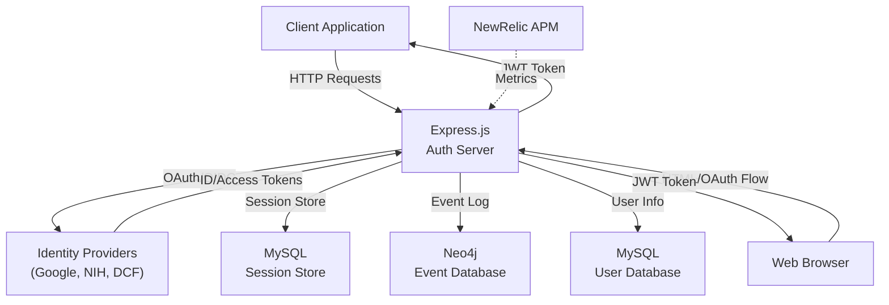

# System Overview: CRDC/CTDC Authentication Service

## Purpose

This is a centralized **Authentication and Authorization (AuthN/AuthZ) microservice** for the Clinical and Translational Data Commons (CTDC) and Cancer Research Data Commons (CRDC) initiatives. It provides federated identity management supporting multiple external identity providers (IDPs) and token-based authentication for downstream clients.

## High-Level Architecture

## Core Responsibilities

1. **OAuth 2.0 / OIDC Broker**: Authenticates users against multiple external identity providers
2. **Session Management**: Maintains user sessions with configurable timeouts
3. **Token Issuance**: Issues JWT-based access tokens to authenticated users
4. **Token Validation**: Verifies and validates JWT tokens from client requests
5. **Event Logging**: Records authentication events (login, logout, etc.) for auditing
6. **User Profile Management**: Stores and retrieves user information linked to external identities

## Technology Stack

- **Runtime**: Node.js + Express.js `^4.18.2`
- **Session Store**: MySQL + `express-mysql-session`
- **Event Log**: Neo4j `^5.5.0` (alternative to MySQL events)
- **Token**: JWT (`jsonwebtoken ^9.0.0`)
- **OAuth Clients**: `googleapis ^95.0.0` for Google; custom NIH/DCF clients
- **Monitoring**: NewRelic APM `^7.3.1`
- **Infrastructure**: Docker containerized; handles CORS and proxy middleware

## Key Deployment Constraints

- **Database Type**: Configurable at startup via `DATABASE_TYPE` env var (MySQL or Neo4j)
- **Session Timeout**: Configurable (default: 30 minutes)
- **Default IDP**: Configurable (default: Google)
- **Token Secret**: Required for JWT signing and verification
- **Multi-IDP Support**: Simultaneously supports Google, NIH, DCF, Fence, and test IDP

## Supported Endpoints

- `POST /api/auth/login` — Authenticate user against configured IDP
- `POST /api/auth/logout` — Clear session and optionally revoke IDP tokens
- `POST /api/auth/authenticated` — Verify current session is valid
- `POST /api/auth/cleanUp` — Token refresh and expired session cleanup
- `GET /api/auth/ping` — Health check
- `GET /api/auth/version` — Version and build date info
- `GET /api/auth/session-ttl` — Current session time-to-live

## Known Architectural Decisions

| Decision | Rationale |
|----------|-----------|
| Dual DB support (MySQL + Neo4j) | Allows flexible deployment and event storage strategy |
| JWT tokens | Stateless, scalable token validation without central store lookup |
| Session store in MySQL | Faster reads than Neo4j for session-heavy workloads |
| Event log in Neo4j | Graph model supports complex audit queries (e.g., user activity timelines) |
| Multiple IDPs | Different institutions use different auth systems (NIH, Google, DCF) |

## Deployment Model

- **Containerized** via [Dockerfile](../../Dockerfile)
- **Stateless except for session store** (scale horizontally behind load balancer)
- **Startup**: `npm start` → runs `node ./bin/www`
- **Configuration**: Environment variables (see [README.md](../../README.md))

## Confidence Notes

- **Observed**: App structure, entry point, core routes, service layer
- **Inferred**: Event logging strategy based on config flags and Neo4j operations
- **Unknown**: Exact IDP-specific error handling; DCF client behavior (not inspected)

---

See [Components](./architecture/components.md) for module breakdown and [Runtime Flows](./architecture/runtime-flows.md) for request processing sequences.
