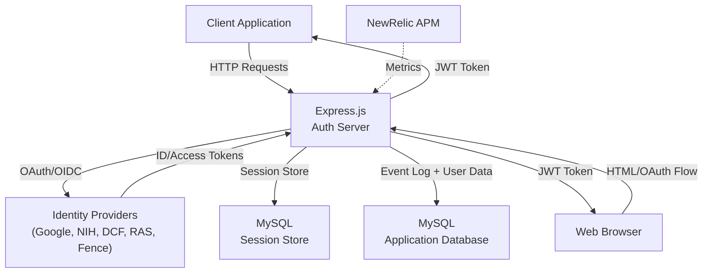

# System Overview: CRDC/CTDC Authentication Service

## Purpose

This is a centralized **Authentication and Authorization (AuthN/AuthZ) microservice** for the Clinical and Translational Data Commons (CTDC) and Cancer Research Data Commons (CRDC) initiatives. It provides federated identity management supporting multiple external identity providers (IDPs) and token-based authentication for downstream clients.

## High-Level Architecture

## Core Responsibilities

1. **OAuth 2.0 / OIDC Broker**: Authenticates users against multiple external identity providers
2. **Session Management**: Maintains user sessions with configurable timeouts
3. **Token Issuance**: Issues JWT-based access tokens to authenticated users
4. **Token Validation**: Verifies and validates JWT tokens from client requests
5. **Event Logging**: Records authentication events (login, logout, etc.) for auditing
6. **User Profile Management**: Stores and retrieves user information linked to external identities
7. **Passport Retrieval**: Returns the stored GA4GH Passport JWT for the authenticated session when available

## Technology Stack

- **Runtime**: Node.js + Express.js `^4.18.2`
- **Session Store**: MySQL + `express-mysql-session`
- **Application Data and Event Log**: MySQL
- **Token**: JWT (`jsonwebtoken ^9.0.0`)
- **OAuth Clients**: `googleapis ^95.0.0` for Google; custom NIH, RAS, DCF, and Fence clients
- **Monitoring**: NewRelic APM `^7.3.1`
- **Infrastructure**: Docker containerized; handles CORS and proxy middleware

## Key Deployment Constraints

- **Database Type**: Current startup path requires `DATABASE_TYPE=MYSQL`
- **Session Timeout**: Configurable (default: 30 minutes)
- **Default IDP**: Configurable (default: Google)
- **Token Secret**: Required for JWT signing and verification
- **Multi-IDP Support**: Simultaneously supports Google, NIH, DCF, Fence, RAS, and test IDP
- **RAS Passport Handling**: RAS tokens include GA4GH Passport claims; passports are persisted to MySQL for downstream claim access

The repository still contains Neo4j-related modules and environment variables, but the active route initialization in `routes/auth.js` only accepts `MYSQL` and throws for any other database type.

## Supported Endpoints

- `POST /api/auth/login` — Authenticate user against configured IDP
- `POST /api/auth/logout` — Clear session and optionally revoke IDP tokens
- `POST /api/auth/authenticated` — Verify current session is valid
- `GET /api/auth/userInfo` — Return the stored GA4GH Passport JWT for the current authenticated session
- `POST /api/auth/refresh` — Refresh RAS tokens using refresh token from session (RAS-specific)
- `POST /api/auth/cleanUp` — Token refresh and expired session cleanup
- `GET /api/auth/ping` — Health check
- `GET /api/auth/version` — Version and build date info
- `GET /api/auth/session-ttl` — Current session time-to-live

## Known Architectural Decisions

| Decision | Rationale |
|----------|-----------|
| MySQL-backed runtime path | The active route initialization only constructs services when `DATABASE_TYPE` is `MYSQL` |
| JWT tokens | Stateless, scalable token validation without central store lookup |
| Session store in MySQL | Sessions are persisted through MySQL-backed middleware |
| Event log in MySQL | Login/logout events are written through `services/mySQL/mySQL-operations.js` in the current implementation |
| Multiple IDPs | Different institutions use different auth systems (NIH, Google, DCF, RAS) |
| RAS Passport Persistence | GA4GH Passports from RAS are stored in `ctdc.user_passports` table for claim extraction by downstream services |
| Session-scoped Passport Lookup | The passport retrieval route resolves the active session to `email` and `IDP`, then queries `ctdc.user_passports` without returning decoded claims or other user metadata |
| RAS Reactive Refresh | RAS tokens use single-attempt refresh on 401 response; no retry loop to prevent refresh storms |

## Deployment Model

- **Containerized** via [Dockerfile](../../Dockerfile)
- **Stateless except for session store** (scale horizontally behind load balancer)
- **Startup**: `npm start` → runs `node ./bin/www`
- **Configuration**: Environment variables (see [README.md](../../README.md))

## Confidence Notes

- **Observed**: App structure, entry point, core routes, service layer
- **Observed**: Current runtime path uses MySQL for sessions and event writes; `routes/auth.js` rejects non-MySQL `DATABASE_TYPE` values
- **Observed**: Neo4j modules and config fields remain in the repository but are not part of the active startup path
- **Observed**: RAS integration (added 2026-04-22) with reactive token refresh and GA4GH Passport persistence
- **Observed**: Passport retrieval endpoint (added 2026-04-23) uses `req.sessionID` plus MySQL-backed session data to return the stored GA4GH Passport JWT for the authenticated user
- **Unknown**: Exact IDP-specific error handling; DCF client behavior (not inspected); Fence client behavior (not inspected)

---

See [Components](./architecture/components.md) for module breakdown and [Runtime Flows](./architecture/runtime-flows.md) for request processing sequences.
