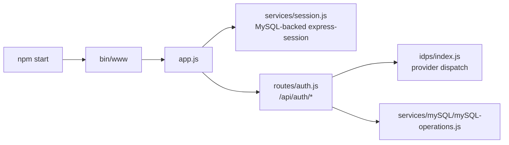

# System Overview: CRDC/CTDC Authentication Service

## Scope

- **Observed**: The service is an Express application started by `bin/www` and exported from `app.js`.
- **Observed**: The primary API surface is under `/api/auth` and is mounted from `routes/auth.js`.
- **Observed**: Authentication is delegated to external IDPs (Google, NIH/Login.gov, DCF, RAS, and test IDP).
- **Observed**: Sessions are persisted via `express-session` + `express-mysql-session`.
- **Observed**: Health and metadata endpoints are implemented directly in `app.js` (`/api/auth/ping`, `/api/auth/version`, `/api/auth/session-ttl`).

## Entrypoints And Startup

- **Observed entrypoint**: `npm start` runs `node ./bin/www`.
- **Observed startup path**:
    1. `bin/www` loads `app.js`.
    2. `app.js` configures middleware, session store, and auth routes.
    3. `routes/auth.js` constructs route-level services only when `DATABASE_TYPE=MYSQL`; otherwise startup throws.

## Runtime Boundary

- **Observed inbound**: HTTP/JSON requests and browser-based OAuth callbacks.
- **Observed outbound**: OAuth/token/userinfo calls to IDP APIs and SQL operations to MySQL.
- **Inferred**: Service is intended to run as a stateless HTTP app except for MySQL-backed sessions.
- **Unknown**: Exact deployment topology and load balancer behavior are not defined in code.

## Major Responsibilities

1. **Observed**: Login orchestration via IDP-specific clients (`POST /api/auth/login`).
2. **Observed**: Session lifecycle management and logout (`POST /api/auth/logout`).
3. **Observed**: Session-backed authenticated checks (`POST /api/auth/authenticated`).
4. **Observed**: RAS login path validates `passport_jwt_v11` during login/auth checks in provider code.
5. **Observed**: User info retrieval by active session (`GET /api/auth/userInfo`) returns session userInfo data.
6. **Observed**: Event recording through `EventService` into MySQL path.
7. **Observed**: Operational endpoints for ping/version/session TTL.

## Key Constraints

- **Observed**: `routes/auth.js` throws if `DATABASE_TYPE` is not `MYSQL`.
- **Observed**: Session timeout defaults to 30 minutes in `config.js` (milliseconds internally).
- **Observed**: Token verification utility exists (`services/token-service.js`) for bearer token checks.
- **Inferred**: Most auth state is session-centric; bearer token verification appears scoped to cleanup/token checks.

## Document Reliability

- **Observed**: Existing docs already describe RAS refresh and passport retrieval.
- **Observed**: Some earlier wording implied this service issues its own JWTs; code mostly validates tokens and stores IDP bundles.
- **Unknown**: Complete production behavior for DCF and Fence flows was not fully traced in this bootstrap pass.

See `docs/architecture/components.md` for component boundaries and `docs/architecture/runtime-flows.md` for flow categories.
